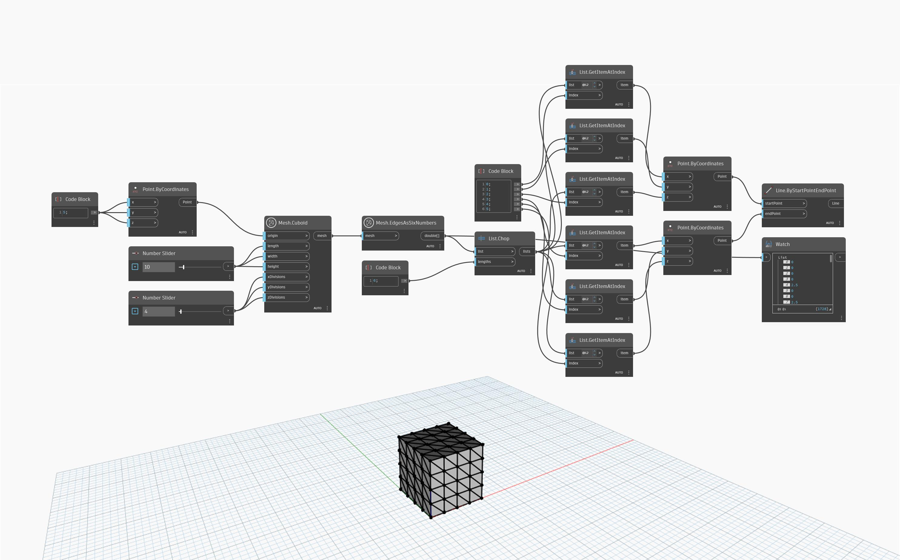

## Informacje szczegółowe
Węzeł `Mesh.EdgesAsSixNumbers` określa współrzędne X, Y i Z wierzchołków tworzących każdą unikatową krawędź w podanej siatce, co daje w wyniku sześć liczb na krawędź. Ten węzeł może być używany do badania lub rekonstrukcji siatki lub jej krawędzi.

W poniższym przykładzie węzeł `Mesh.Cuboid` tworzy siatkę prostopadłościanu, która jest następnie używana jako dane wejściowe węzła `Mesh.EdgesAsSixNumbers` w celu pobrania listy krawędzi wyrażonych jako sześć liczb. Lista zostaje dalej podzielona na listy po 6 pozycji za pomocą węzła `List.Chop`, a następnie za pomocą węzłów `List.GetItemAtIndex` i `Point.ByCoordinates` są odtwarzane listy punktów początkowych i końcowych każdej krawędzi. Na koniec węzeł `List.ByStartPointEndPoint` jest używany do rekonstrukcji krawędzi siatki.

## Plik przykładowy

