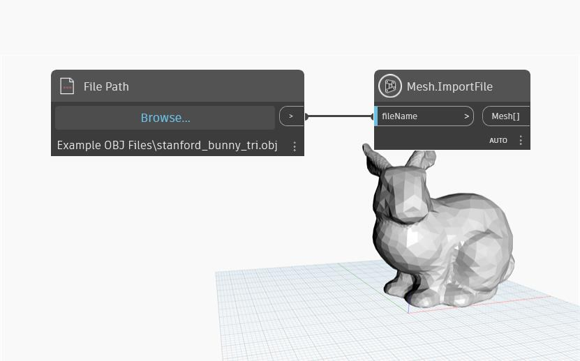

## Informacje szczegółowe
Węzeł `Mesh.ImportFile` pobiera jako dane wejściowe nazwę pliku ze zdefiniowanej ścieżki pliku. Typy plików mogą być następujące:
- .obj - plik Wavefront OBJ
- .mix - plik Meshmixer
- .stl - plik STL
- .ply - format pliku wielokąta

## Plik przykładowy

