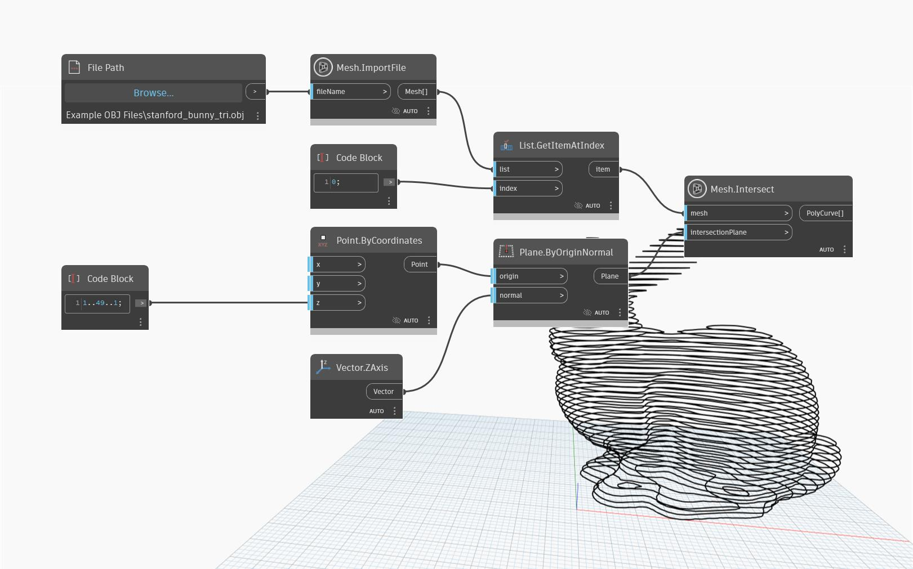

## Informacje szczegółowe
Węzeł `Mesh.Intersect` przecina siatkę za pomocą płaszczyzny wejściowej i zwraca co najmniej jedną krzywą PolyCurve.

W poniższym przykładzie do siatki w kształcie królika jest stosowany węzeł `Mesh.Intersect`. Siatka jest przecinana za pomocą szeregu płaszczyzn wejściowych w celu utworzenia warstw w postaci konturów. Jest to punkt wyjścia do przygotowania modelu do produkcji na przecinarce laserowej, wodnej lub frezarce CNC.

## Plik przykładowy

