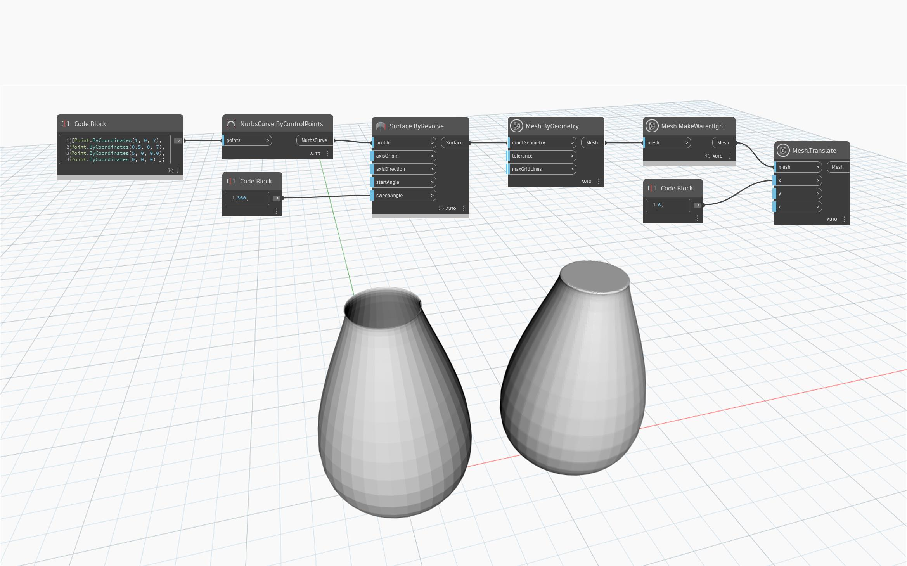

## Informacje szczegółowe
Węzeł `Mesh.MakeWatertight` generuje bryłową, szczelną i nadającą się do druku 3D siatkę przez próbkowanie pierwotnej siatki. Zapewnia szybki sposób rozwiązywania problemów w przypadku siatki z licznymi problemami, takimi jak przecięcia własne, nakładania się i geometria nierozmaitościowa. Ta metoda oblicza cienkopasmowe pole odległości i generuje nową siatkę przy użyciu algorytmu maszerujących sześcianów, ale nie powoduje rzutowania z powrotem na pierwotną siatkę. Jest to bardziej odpowiednie w przypadku obiektów siatki, które mają liczne wady lub trudne do rozwiązania problemy, takie jak przecięcia własne.
Poniższy przykład przedstawia nieszczelny kształt wazonu i jego szczelny odpowiednik.

## Plik przykładowy

