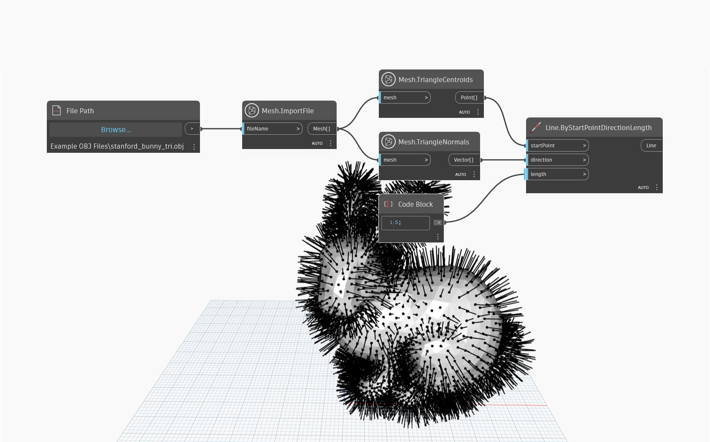

## In-Depth
`Mesh.TriangleCentroids` node returns the center point of each triangular face on a mesh. 

In the example below, we are using `Mesh.TriangleCentroids` in combination with `Mesh.TriangleNormals` to draw the normals of each face of the mesh.

## Example File

