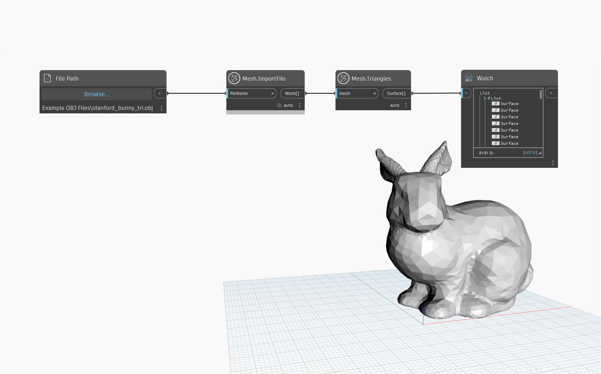

## Informacje szczegółowe
Metoda `Mesh.Triangles` zwraca powierzchnie siatki jako listę powierzchni. Wszystkie powierzchnie są trójkątami. Za pomocą tego węzła można ponownie skonstruować siatkę, zwizualizować jej strukturę lub przekonwertować ją na inne klasy geometrii.

## Plik przykładowy

