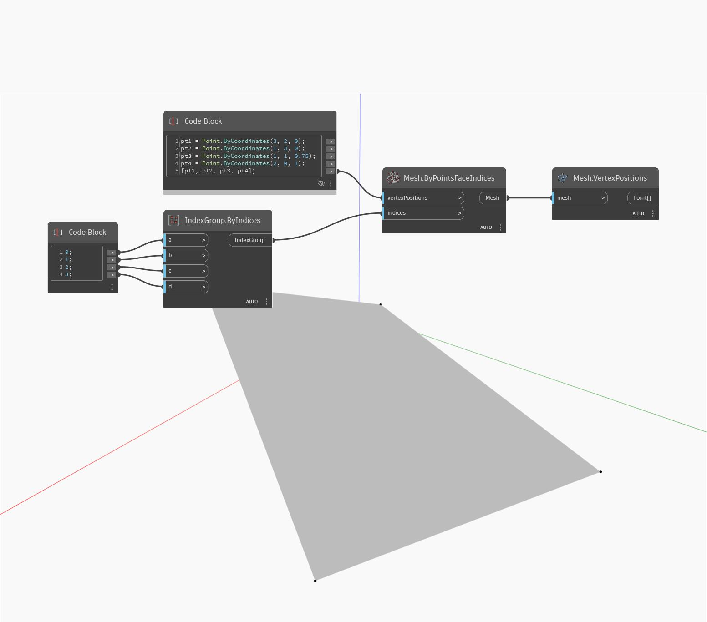

## Informacje szczegółowe
Węzeł VertexPositions zwraca położenia wierzchołków powierzchni siatki jako punkty. W poniższym przykładzie zwracane są położenia wierzchołków powierzchni siatki czterostronnej jako punkty.
___
## Plik przykładowy

