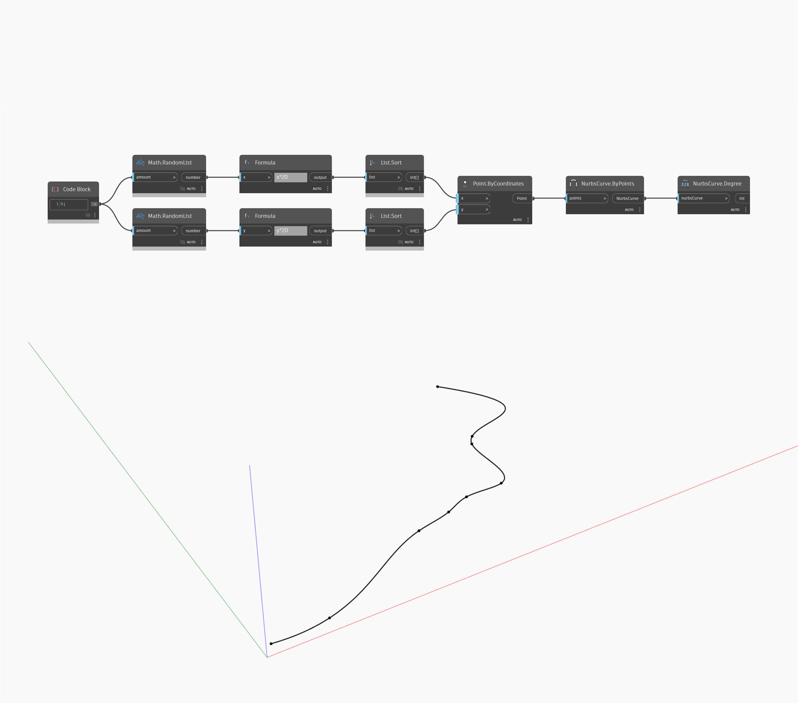

## Informacje szczegółowe
Węzeł Degree zwraca stopień krzywej NURBS. W tym przykładzie najpierw generujemy zestaw punktów losowych, a następnie za pomocą węzła NurbsCurve ByPoints tworzymy krzywą interpolowaną przy użyciu tych punktów. Następnie za pomocą węzła Degree możemy uzyskać stopień tej krzywej. Ponieważ utworzyliśmy krzywą bez określania stopnia, użyto domyślnego trzeciego stopnia. (Krzywa wieloboczna złożona z linii prostych jest krzywą pierwszego stopnia, natomiast najpowszechniejszym stopniem krzywych niezłożonych z segmentów prostych jest stopień trzeci)
___
## Plik przykładowy

