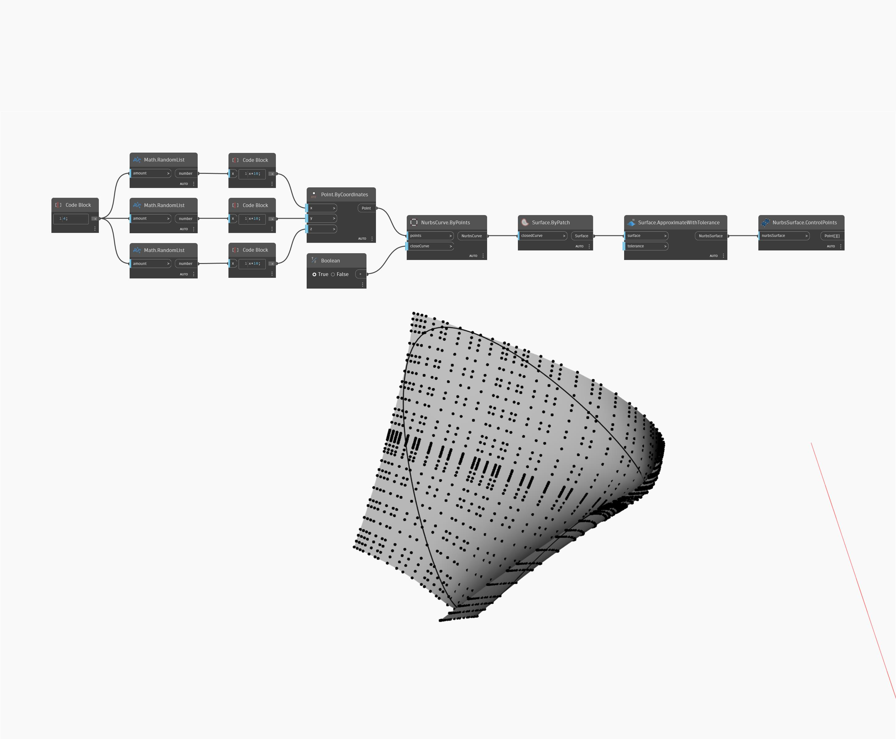

## Informacje szczegółowe
Węzeł ControlPoints zwraca punkty sterujące powierzchni Nurbs jako punkty na liście list. W poniższym przykładzie są zwracane punkty sterujące dla powierzchni NurbsSurface utworzonej za pomocą węzła ByPatch.
___
## Plik przykładowy

