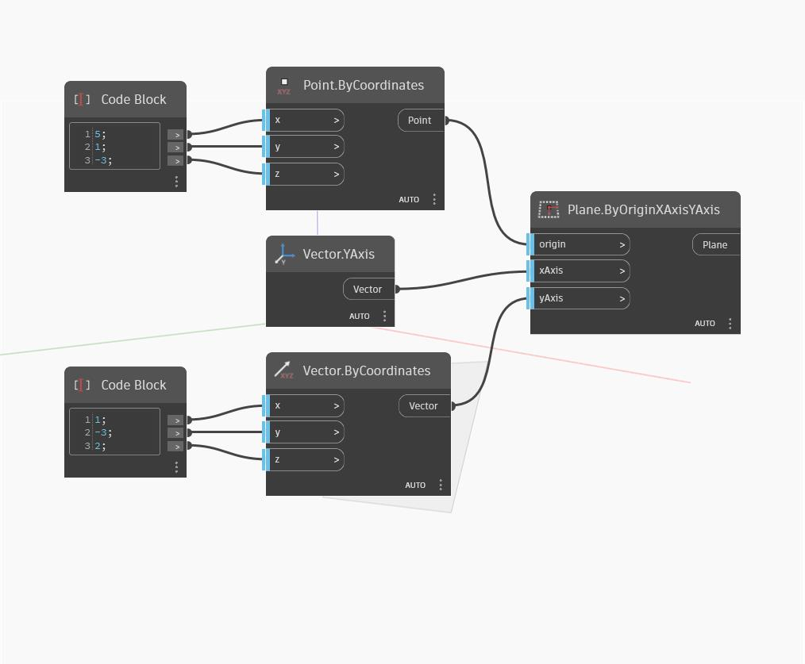

## Informacje szczegółowe
Węzeł Plane by Origin XAxis YAxis pobiera punkt początkowy (origin) i dwa wektory w celu zdefiniowania płaszczyzny. Wektor normalny płaszczyzny jest tworzony przez wyznaczenie iloczynu wektorowego wektorów osi X i Y. W poniższym przykładzie używamy globalnej osi Y jako xAxis oraz za pomocą dwóch węzłów Code Block definiujemy punkt początkowy oraz yAxis.
___
## Plik przykładowy

