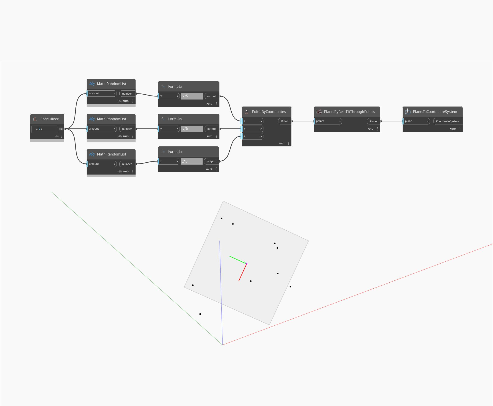

## Informacje szczegółowe
Węzeł Plane To Coordinate System zwraca układ współrzędnych na podstawie płaszczyzny wejściowej (plane), używając punktu początkowego płaszczyzny, osi X i osi Y. W poniższym przykładzie używamy zestawu punktów losowych, aby utworzyć płaszczyznę za pomocą węzła Plane by Best Fit Through Points. Następnie za pomocą węzła ToCoordinateSystem możemy przekonwertować płaszczyznę na układ współrzędnych.
___
## Plik przykładowy

