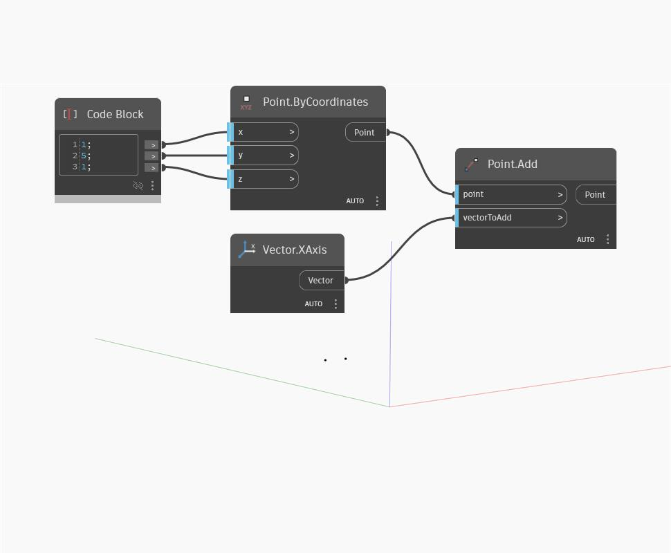

## Informacje szczegółowe
Węzeł `Point.Add` dodaje składowe x, y i z wektora wejściowego do odpowiednich współrzędnych punktu wejściowego. Działa to tak samo jak przekształcenie punktu za pomocą danego wektora i jest równoważne użyciu węzła `Geometry.Translate (vector)`.

W poniższym przykładzie tworzymy punkt za pomocą węzła Code Block określającego współrzędne x, y i z, a następnie dodajemy wektor globalnej osi X jako pozycję `vectorToAdd`. Wynik jest punktem przekształconym o odległość równą 1 w kierunku dodatnim osi X.

___
## Plik przykładowy

