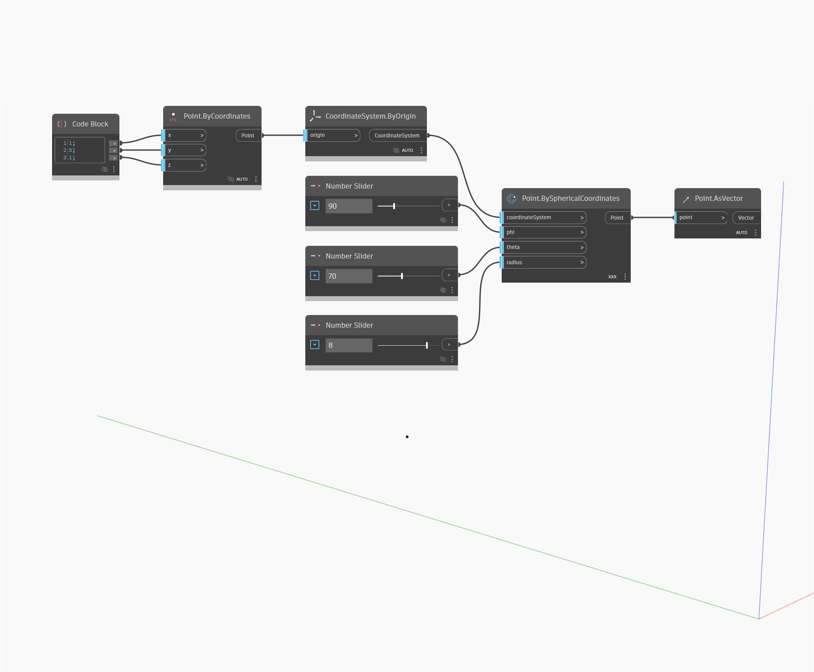

## Informacje szczegółowe
Węzeł Point as Vector pobiera punkt (point) i zwraca wektor z komponentami x, y i z równymi współrzędnym kartezjańskim danego punktu. Można to również traktować jako tworzenie wektora na podstawie dwóch punktów, gdzie pierwszy punkt jest początkiem globalnym, a drugi — punktem wejściowym. W poniższym przykładzie generujemy punkt za pomocą węzła PointBySphericalCoordinates, a następnie przy użyciu węzła AsVector tworzymy wektor, którym można sterować za pomocą współrzędnych sferycznych.
___
## Plik przykładowy

