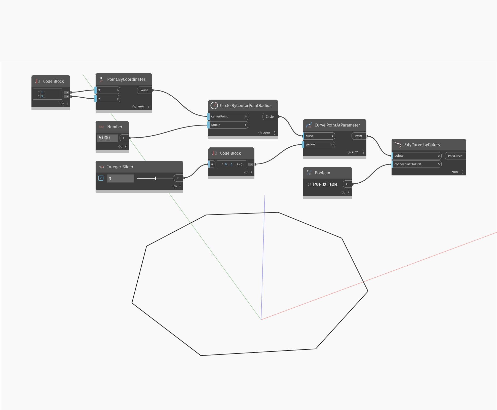

## Informacje szczegółowe
Węzeł `PolyCurve.ByPoints` tworzy połączone krzywe z zestawu wierzchołków. Ten węzeł umożliwia również przełączanie między kształtem zamkniętym i otwartym za pomocą pozycji danych wejściowych `connectLastToFirst`.

W poniższym przykładzie wzdłuż okręgu są tworzone punkty, które są następnie rysowane ponownie za pomocą węzła `PolyCurve.ByPoints` w celu utworzenia kształtu wielokąta zamkniętego.

___
## Plik przykładowy

