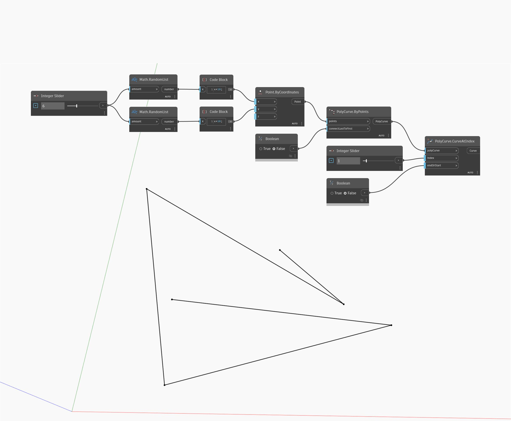

## Informacje szczegółowe
Węzeł Curve At Index zwraca segment krzywej o indeksie wejściowym danej krzywej PolyCurve. Jeśli liczba krzywych w krzywej PolyCurve jest mniejsza niż podany indeks, węzeł CurveAtIndex zwróci wartość null. Wartość wejściowa endOrStart przyjmuje wartość logiczną prawda (true) lub fałsz (false). W przypadku wartości prawda węzeł CurveAtIndex rozpoczyna zliczanie od pierwszego segmentu PolyCurve. W przypadku wartości fałsz zliczanie jest realizowane wstecz od ostatniego segmentu. W poniższym przykładzie generujemy zestaw punktów losowych, a następnie za pomocą węzła PolyCurve By Points tworzymy otwartą krzywą PolyCurve. Następnie za pomocą węzła CurveAtIndex możemy wyodrębnić określone segmenty z krzywej PolyCurve.
___
## Plik przykładowy

