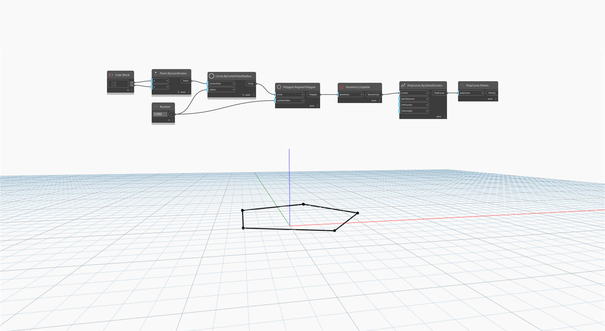

## Informacje szczegółowe
Węzeł `PolyCurve.Points` zwraca punkt początkowy dla pierwszej krzywej składowej i punkty końcowe dla wszystkich innych krzywych składowych. Nie zwraca punktów powielonych dla zamkniętych krzywych PolyCurve.

W poniższym przykładzie wielokąt utworzony za pomocą węzła `Polygon.RegularPolygon` zostaje rozbity na listę krzywych, które zostają następnie ponownie połączone do postaci krzywej PolyCurve. Punkty krzywej PolyCurve są następnie zwracane przy użyciu węzła `PolyCurve.Points`.
___
## Plik przykładowy

