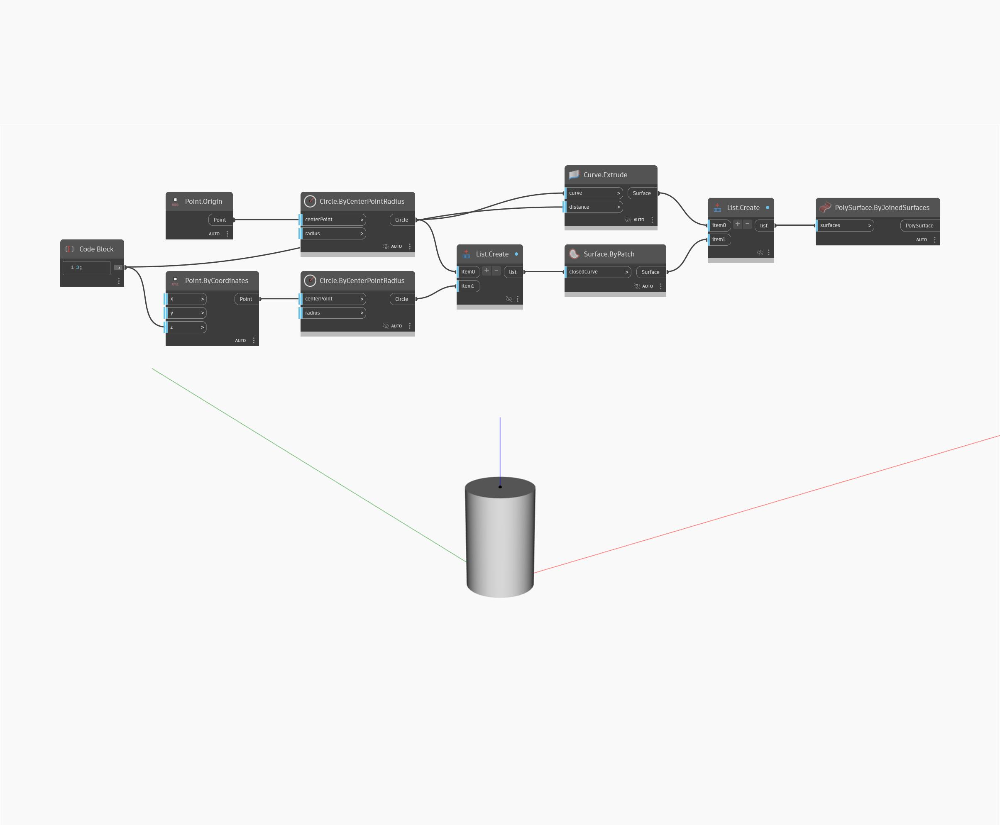

## Informacje szczegółowe
Węzeł `PolySurface.ByJoinedSurfaces` zwraca nową powierzchnię PolySurface połączoną z listą powierzchni.

W poniższym przykładzie dwa płaty powierzchni i wyciągnięcie zostają połączone w powierzchnię PolySurface przypominającą walec.

___
## Plik przykładowy

