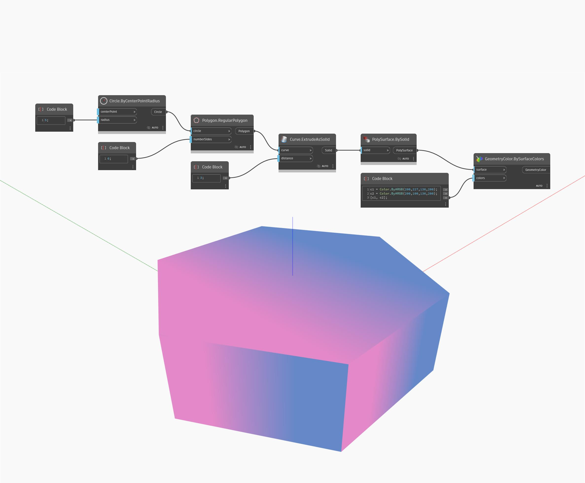

## Informacje szczegółowe
Węzeł BySolid zwraca powierzchnię PolySurface bryły. W poniższym przykładzie bryła jest zwracana jako powierzchnia PolySurface, aby była dopuszczalną pozycją wejściową dla węzła Display.BySurfaceColors.
___
## Plik przykładowy

