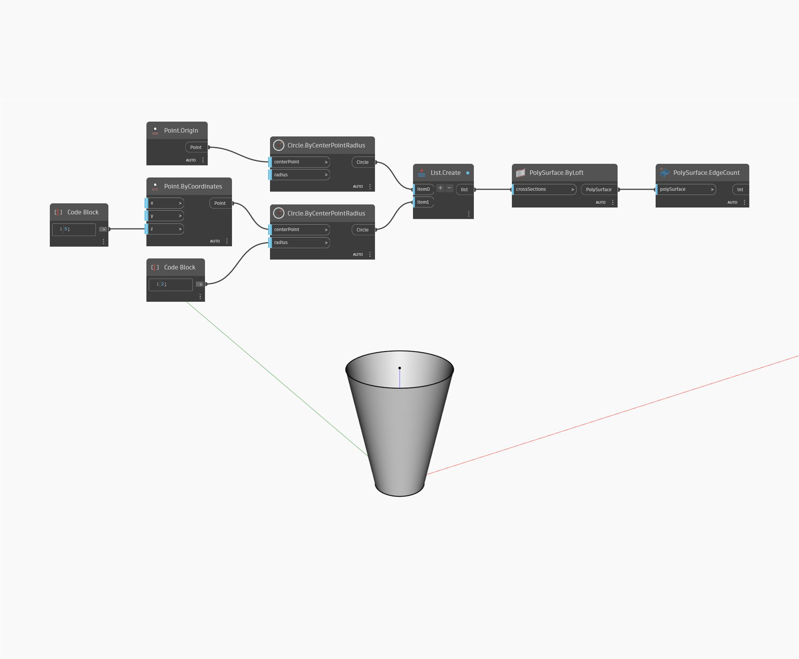

## Informacje szczegółowe
Węzeł EdgeCount zwraca liczbę krawędzi na powierzchni PolySurface. W poniższym przykładzie wyciągnięty sześciokąt ma 18 krawędzi. Krawędzie są reprezentowane za pomocą linii.
___
## Plik przykładowy

