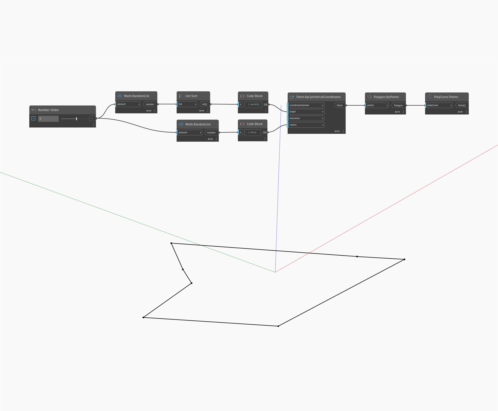

## Informacje szczegółowe
Punkty siatki podstawowej są przydatne przy wykonywaniu zapytań o dane rzędnych lub położenia. Zestawami punktów można manipulować w dodatku Dynamo i można je wprowadzać z powrotem do dodatku Dynamo jako nową topografię.
___
## Plik przykładowy

