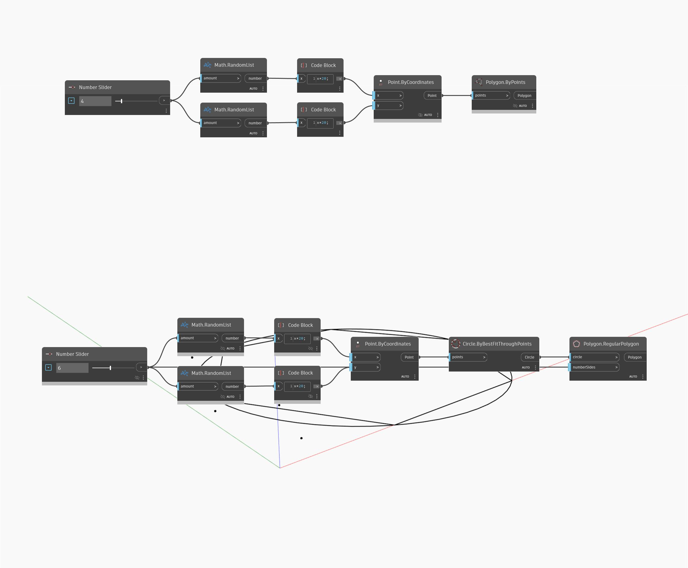

## Informacje szczegółowe
Węzeł Polygon Regular Polygon jest prostym komponentem, który wpisuje wielobok foremny o dowolnej liczbie boków w okrąg. W tym przykładzie tworzymy okrąg odniesienia z punktów losowych za pomocą węzła Best Fit Through Points i rysujemy wielobok sześcioboczny wewnątrz okręgu.
___
## Plik przykładowy

