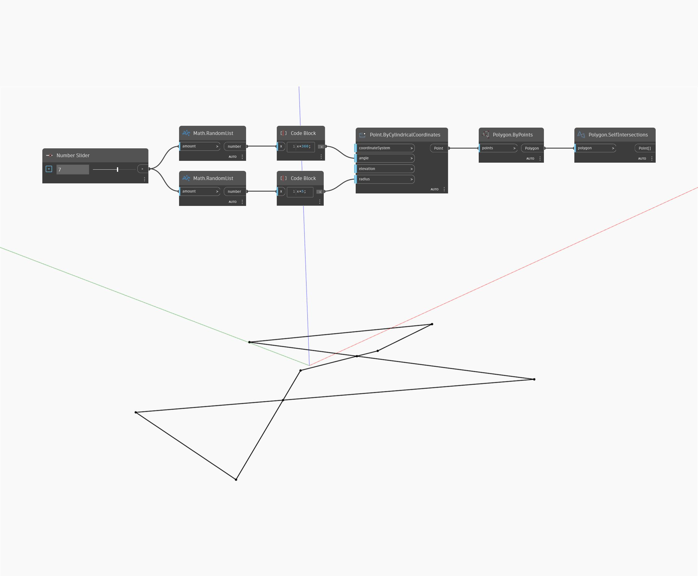

## Informacje szczegółowe
Węzeł Self Intersections zwraca listę wszystkich punktów, w których wielobok (polygon) przecina się z samym sobą. W poniższym przykładzie najpierw generujemy listę losowych nieposortowanych kątów i promieni do użycia w węźle Points By Cylindrical Coordinates. Ponieważ zachowaliśmy stałą rzędną i nie posortowaliśmy kątów tych punktów, wielobok utworzony za pomocą węzła Polygon By Points będzie płaski i prawdopodobnie będzie przecinał się z samym sobą. Następnie za pomocą węzła Self Intersections możemy znaleźć punkty przecięcia.
___
## Plik przykładowy

