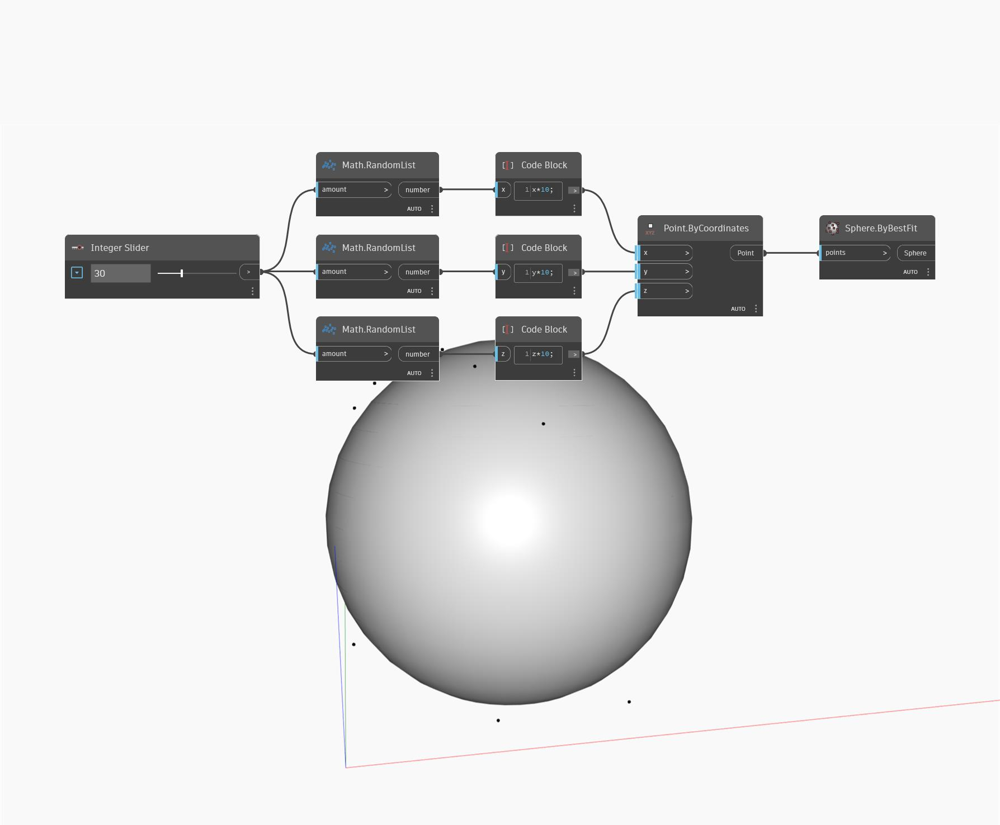

## Informacje szczegółowe
Węzeł Sphere by Best Fit tworzy sferę na podstawie listy punktów (points). Sfera jest tworzona w celu zminimalizowania średniej odległości od listy punktów do powierzchni sfery. W poniższym przykładzie generujemy zestaw liczb losowych, których użyjemy jako współrzędnych x, y i z na liście punktów. Liczbą punktów steruje suwak Number Slider. Lista punktów służy jako dane wejściowe dla węzła Sphere ByBestFit.
___
## Plik przykładowy

