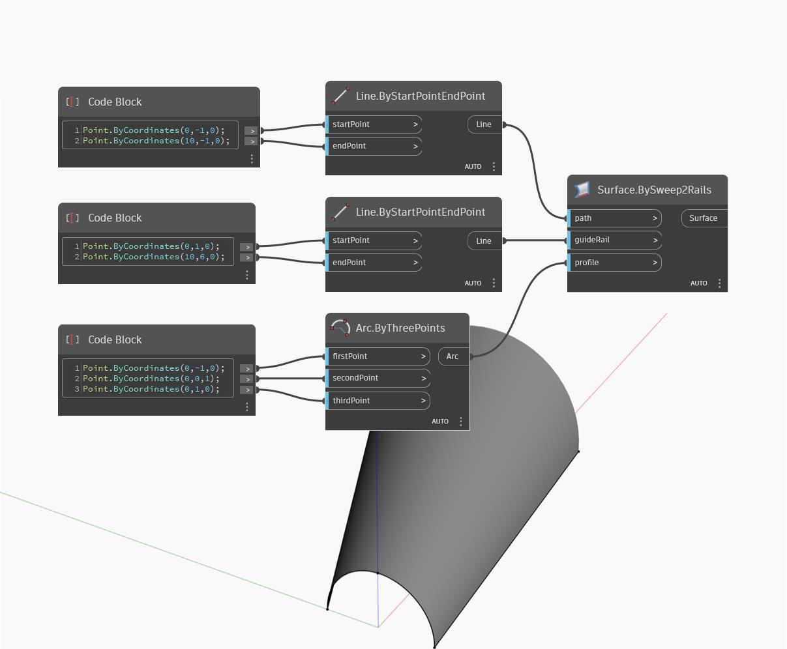

## Informacje szczegółowe
Węzeł Surface by Sweep 2 Rails pobiera krzywą wejściową i używa dwóch krzywych prowadzących do przeciągnięcia tej krzywej profilu. W poniższym przykładzie używamy półokręgu jako profilu wejściowego. Tworzymy dwie linie rozbieżne, które posłużą jako krzywe prowadnic dla węzła BySweep2Rails. Wynik jest powierzchnią o profilu półokręgu, która rośnie w miarę przesuwania się łuku wzdłuż linii rozbieżnych.
___
## Plik przykładowy

