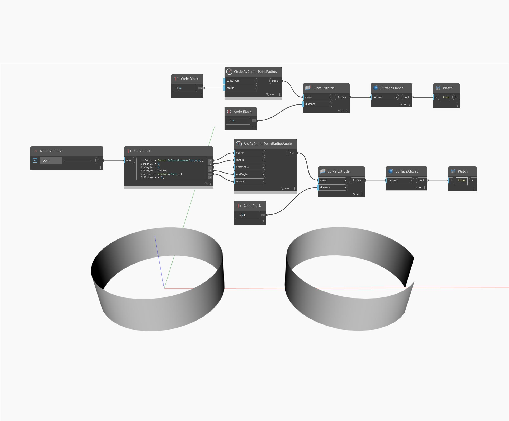

## Informacje szczegółowe
Węzeł Closed zwraca wartość logiczną określającą, czy powierzchnia jest zamknięta w kierunku U lub V. W poniższym przykładzie testowane są dwie wyciągnięte powierzchnie i dla wyciągniętego okręgu zwracana jest wartość prawda (true). Dostosowując suwak Number Slider można także zamknąć wyciągnięty łuk do okręgu i spowodować zwrócenie wartości prawda (true).
___
## Plik przykładowy

