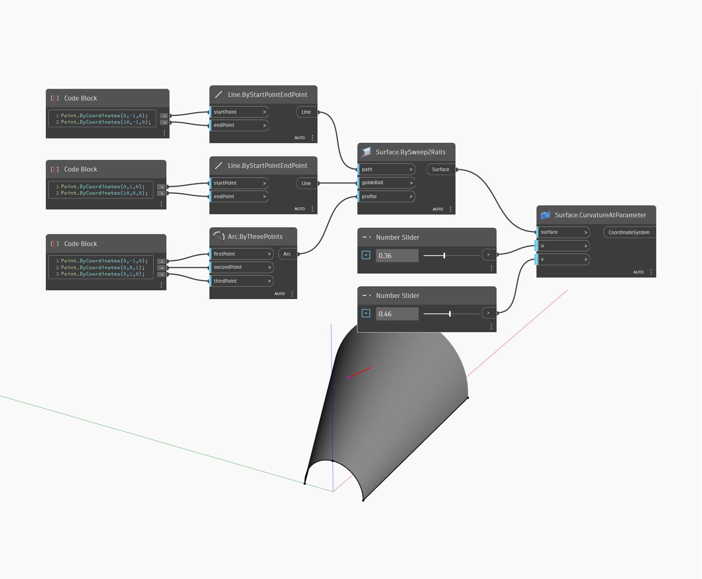

## Informacje szczegółowe
Węzeł Curvature At Parameter używa parametrów wejściowych U i V oraz zwraca układ współrzędnych na podstawie wektora normalnego, kierunku U i kierunku V w położeniu UV na powierzchni. Wektor normalny określa oś Z, natomiast kierunki U i V określają kierunki osi X i Y. Długość osi jest określana przez krzywiznę U i V. W poniższym przykładzie najpierw tworzymy powierzchnię za pomocą węzła BySweep2Rails. Następnie za pomocą dwóch suwaków Number Slider określamy parametry U i V w celu utworzenia układu współrzędnych przy użyciu węzła CurvatureAtParameter.
___
## Plik przykładowy

