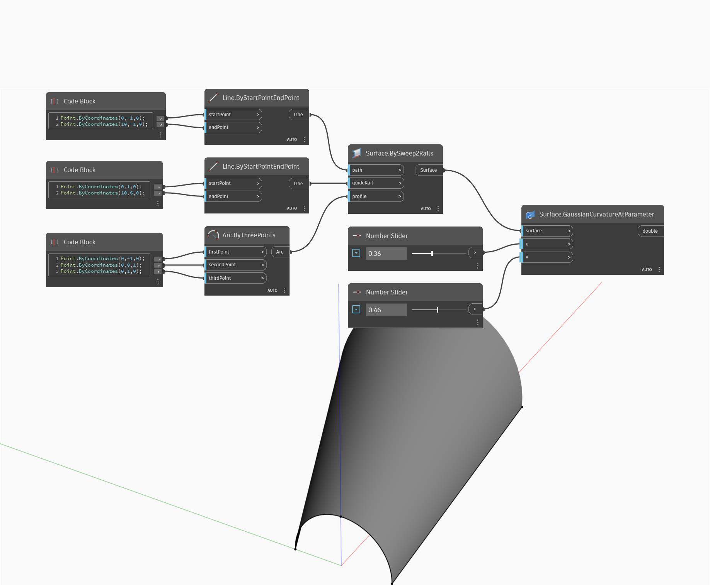

## Informacje szczegółowe
Węzeł Gaussian Curvature At Parameter używa parametrów wejściowych U oraz V i zwraca krzywiznę powierzchni w wejściowym położeniu UV powierzchni. Krzywizna Gaussa jest obliczana jako iloczyn dwóch głównych krzywizn (w kierunkach U i V). W poniższym przykładzie najpierw tworzymy powierzchnię za pomocą węzła BySweep2Rails. Następnie za pomocą dwóch suwaków Number Slider określamy parametry U i V, aby wyznaczyć krzywiznę Gaussa za pomocą węzła GaussianCurvatureAtParameter.
___
## Plik przykładowy

