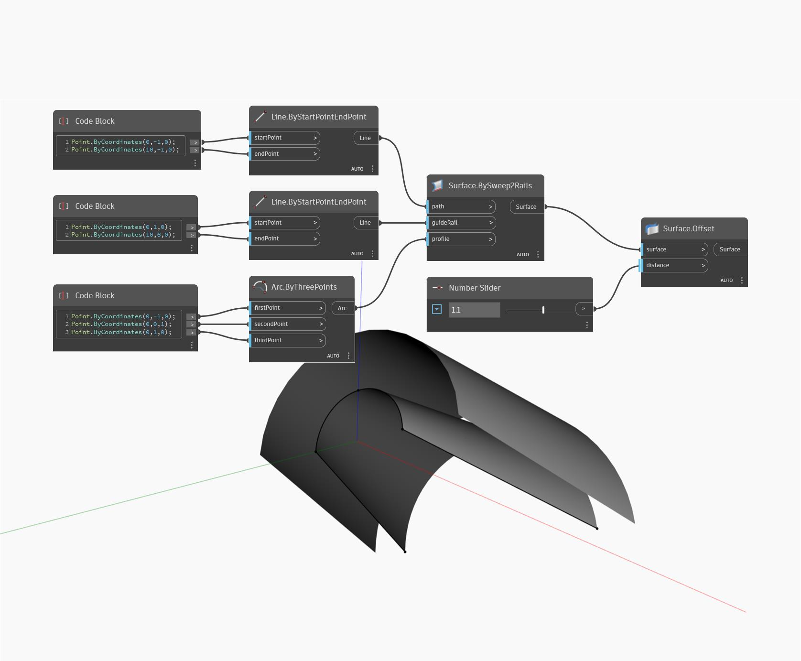

## Informacje szczegółowe
Węzeł Offset tworzy nową powierzchnię odsuniętą od powierzchni wejściowej (surface) o podaną odległość (distance). Dodatnia odległość powoduje odsunięcie powierzchni w kierunku wektora normalnego powierzchni, a ujemna — w kierunku przeciwnym. W poniższym przykładzie najpierw tworzymy powierzchnię za pomocą węzła BySweep2Rails. Następnie za pomocą suwaka Number Slider sterujemy odległością odsunięcia w węźle Offset.
___
## Plik przykładowy

