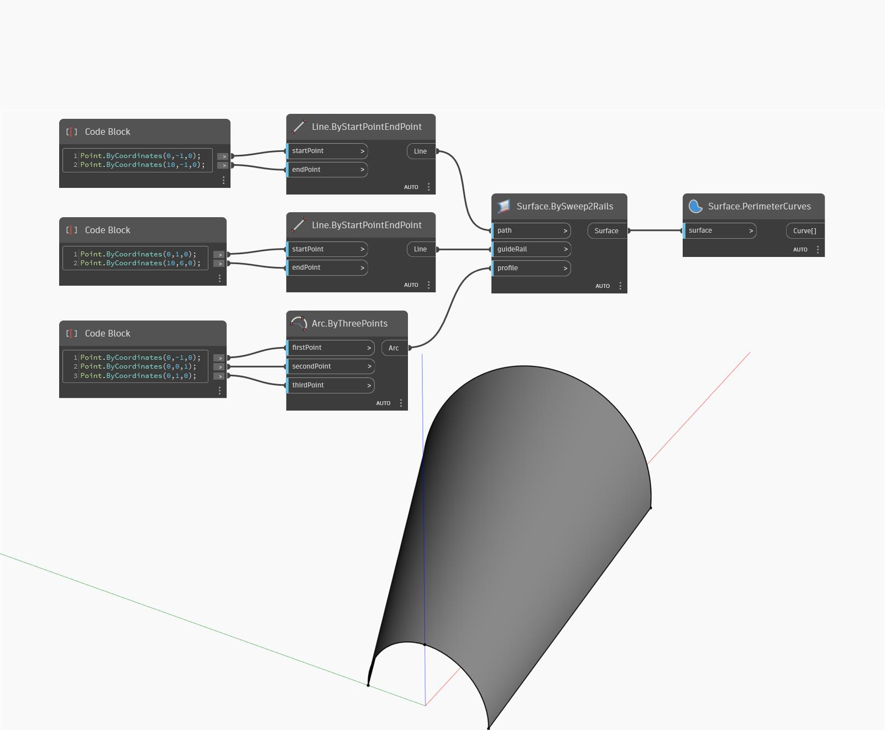

## Informacje szczegółowe
Węzeł Perimeter Curves zwraca krzywe krawędzi otwartej powierzchni (surface) jako listę krzywych. W poniższym przykładzie najpierw tworzymy powierzchnię za pomocą węzła BySweep2Rails. Następnie wyodrębniamy krawędzie obwodu za pomocą węzła PerimeterCurves.
___
## Plik przykładowy

