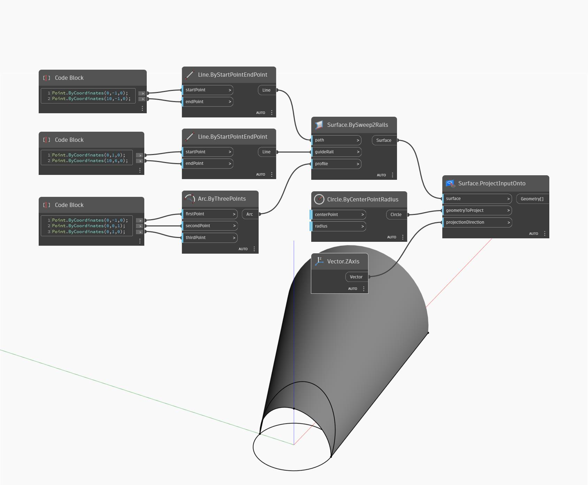

## Informacje szczegółowe
Węzeł Project Input Onto rzutuje geometrię wejściową na daną powierzchnię (surface) wzdłuż danego kierunku. W poniższym przykładzie najpierw tworzymy powierzchnię za pomocą węzła BySweep2Rails. Jest to powierzchnia docelowa rzutowania. Tworzymy okrąg w punkcie początkowym, który będzie używany jako geometria do rzutowania, i po prostu używamy kierunku globalnego Z jako wektora kierunku rzutowania. Wynikiem jest okrąg rzutowany na powierzchnię.
___
## Plik przykładowy

