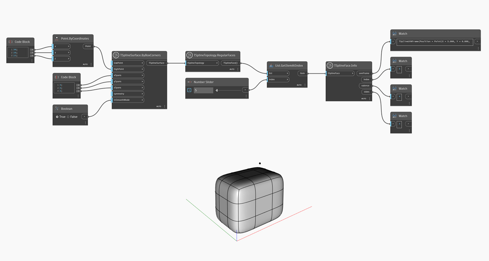

## In-Depth
Węzeł `TSplineFace.Info` zwraca następujące właściwości powierzchni T-splajn:
— `uvnFrame`: punkt na powłoce, wektor U, wektor V i wektor normalny powierzchni T-splajn
— `index`: indeks powierzchni
— `valence`: liczba wierzchołków lub krawędzi tworzących powierzchnię
— `sides`: liczba krawędzi każdej powierzchni T-splajn

W poniższym przykładzie węzły `TSplineSurface.ByBoxCorners` i `TSplineTopology.RegularFaces` służą do odpowiednio utworzenia T-splajnu i wybrania jego powierzchni. Za pomocą węzła `List.GetItemAtIndex` zostaje wybrana określona powierzchnia T-splajnu, a za pomocą węzła `TSplineFace.Info` znalezione zostają jej właściwości.

## Plik przykładowy

