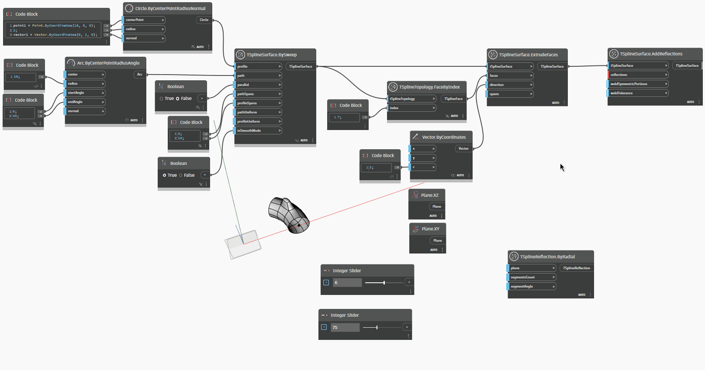

## In-Depth
Węzeł `TSplineReflection.ByRadial` zwraca obiekt `TSplineReflection`, którego można używać jako danych wejściowych węzła `TSplineSurface.AddReflections`. Węzeł przyjmuje płaszczyznę jako dane wejściowe, a wektor normalny tej płaszczyzny pełni rolę osi obrotu geometrii. Podobnie jak obiekt TSplineInitialSymmetry, obiekt TSplineReflection po ustaleniu go dla TSplineSurface wpływa na wszystkie kolejne operacje i zmiany.

W poniższym przykładzie węzeł `TSplineReflection.ByRadial` służy do zdefiniowania odbicia powierzchni T-splajn. Pozycje danych wejściowych `segmentsCount` i `segmentAngle` służą do sterowania sposobem odbijania geometrii wokół wektora normalnego danej płaszczyzny. Dane wyjściowe węzła są następnie używane jako dane wejściowe węzła `TSplineSurface.AddReflections` w celu utworzenia nowej powierzchni T-splajn.

## Plik przykładowy

