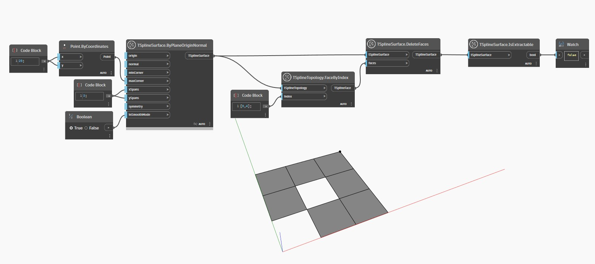

## Informacje szczegółowe
W poniższym przykładzie niektóre powierzchnie w powierzchni T-splajn zostają usunięte i powodują powstanie nieprawidłowej powierzchni. Trybu gładkiego nie można aktywować dla nieprawidłowych powierzchni, a wynikiem węzła `TSplineSurface.IsExtractable` jest `false` (fałsz).
___
## Plik przykładowy

