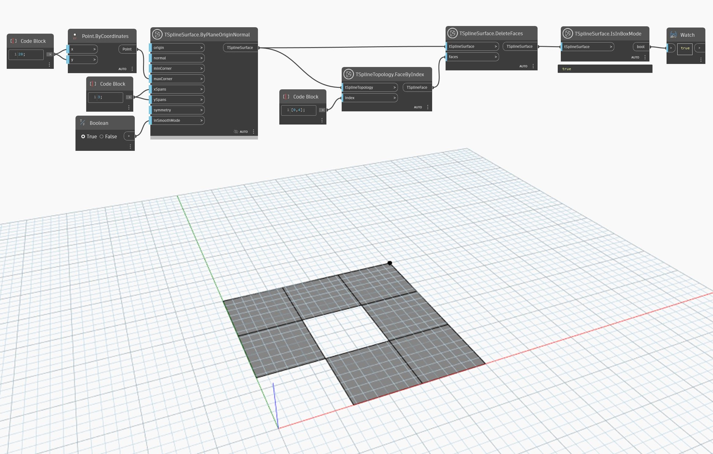

## Informacje szczegółowe
Tryb ramki i tryb gładki to dwa sposoby wyświetlania powierzchni T-splajn. Tryb gładki pozwala uzyskać rzeczywisty kształt powierzchni T-splajn oraz zapewnia podgląd estetyki i wymiarów modelu. Natomiast tryb ramki pozwala przyjrzeć się strukturze powierzchni i lepiej ją zrozumieć, a ponadto jest szybszym sposobem uzyskania podglądu dużej lub złożonej geometrii. Trybami ramki i gładkim można sterować w momencie utworzenia początkowej powierzchni T-splajn lub później za pomocą węzłów takich jak `TSplineSurface.EnableSmoothMode`.

W przypadkach, gdy T-splajn staje się nieprawidłowy, jego podgląd zostaje automatycznie przełączony w tryb ramki. Innym sposobem ustalenia, czy powierzchnia stała się nieprawidłowa, jest użycie węzła `TSplineSurface.IsInBoxMode`.

W poniższym przykładzie zostaje utworzona powierzchnia płaszczyzny T-splajn z pozycją danych wejściowych `smoothMode` o wartości true (prawda). Dwie z jej powierzchni są usunięte, przez co powierzchnia jest nieprawidłowa. Podgląd powierzchni zostaje przełączony w tryb ramki, chociaż nie można tego ustalić na podstawie samego podglądu. Do potwierdzenia, że powierzchnia jest w trybie ramki zostaje użyty węzeł `TSplineSurface.IsInBoxMode`.
___
## Plik przykładowy

