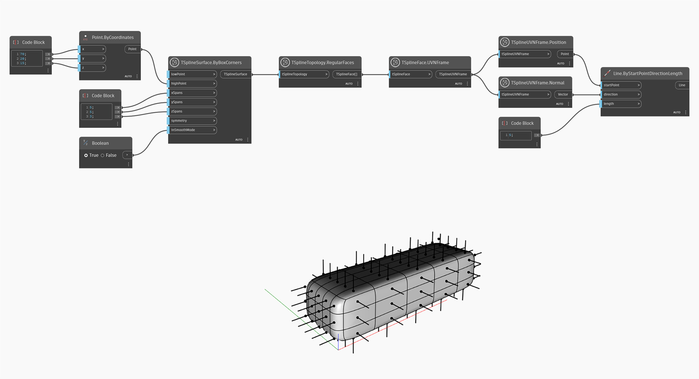

## In-Depth
Węzeł `TSplineUVNFrame.Position` zwraca położenie ramki UVN jako obiekt punktu (Point). Za pomocą tego węzła można zwizualizować położenie wierzchołka lub powierzchni w powierzchni w przypadku wybrania tych elementów za pomocą indeksu.
W poniższym przykładzie ten węzeł służy do wizualizacji kierunku każdej zwykłej powierzchni w powierzchni.

## Plik przykładowy

