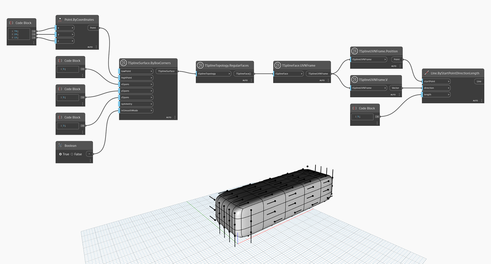

## In-Depth
Węzeł `TSplineUVNFrame.V` zwraca wektor V ramki UVN. W poniższym przykładzie za pomocą linii wizualizowany jest kierunek wektora V w ramkach UVN każdej powierzchni prymitywu prostopadłościanowego T-splajn.

## Plik przykładowy

