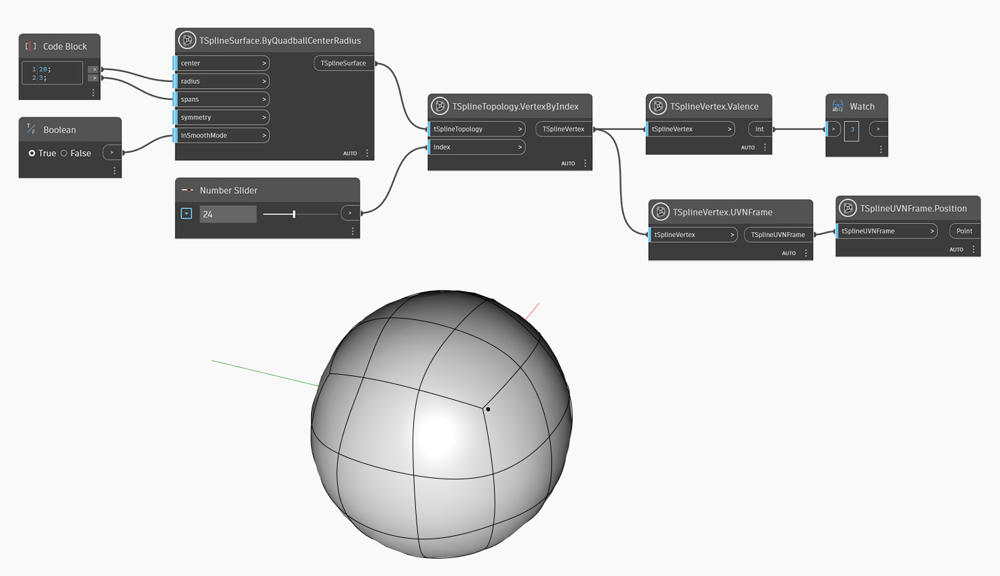

## In-Depth
Węzeł `TSplineVertex.Valence` zwraca liczbę krawędzi połączonych z wierzchołkiem w siatce sterującej. Stopień (valence) wierzchołka wpływa na gładkość i kształt powierzchni.

W poniższym przykładzie węzeł `TSplineVertex.Valence` sprawdza stopień (valence) wierzchołka powierzchni T-splajn prymitywu. Stopień wybranego wierzchołka ma wartość „3”, charakterystyczną dla niektórych punktów gwiazdowych i punktów T. Ramka UVN służy do zwizualizowania położenia badanego wierzchołka.

## Plik przykładowy

