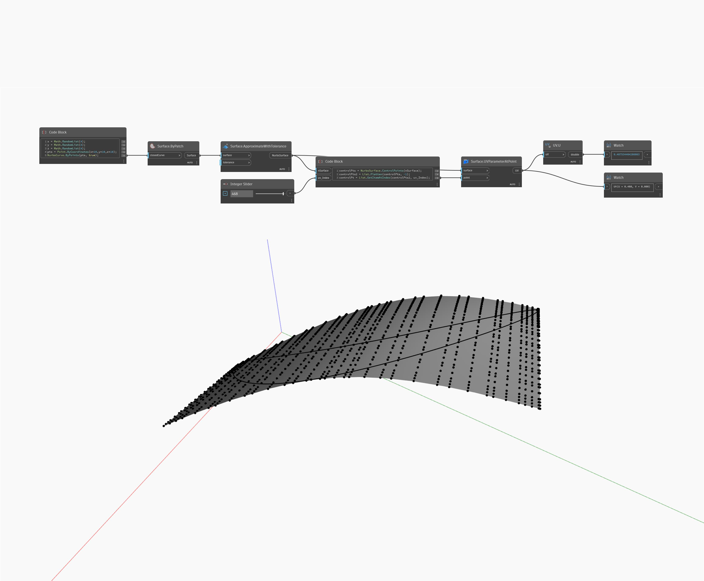

## Informacje szczegółowe
Węzeł U zwraca wartość U współrzędnej UV. W poniższym przykładzie zwracana jest wartość U położenia punktu na powierzchni NurbsSurface. Parametr UV jest zwracany z węzła Surface.UVParamterAtPoint.
___
## Plik przykładowy

