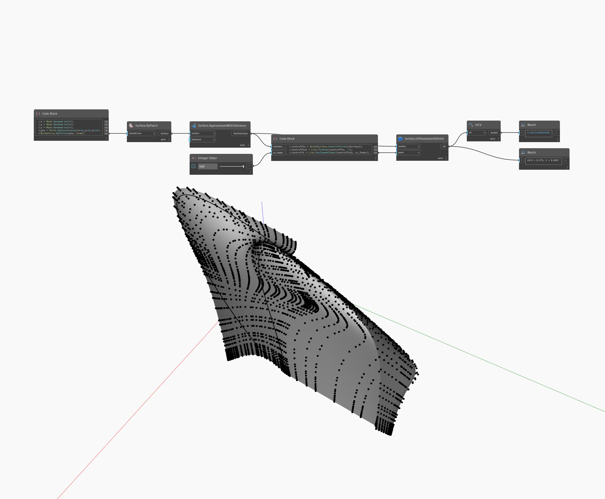

## Informacje szczegółowe
Węzeł V zwraca wartość V współrzędnej UV. W poniższym przykładzie zwracana jest wartość V położenia punktu na powierzchni NurbsSurface. Parametr UV jest zwracany z węzła Surface.UVParamterAtPoint.
___
## Plik przykładowy

