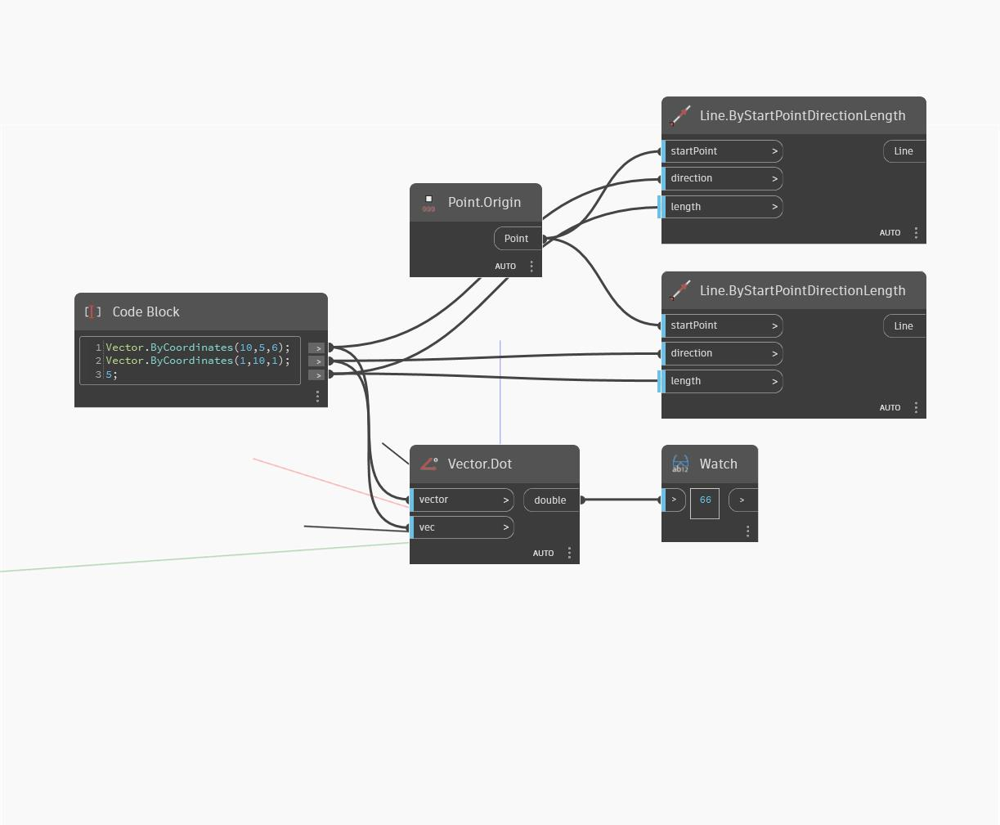

## Informacje szczegółowe
Węzeł Dot zwraca iloczyn skalarny dwóch wektorów jako liczbę typu double. W poniższym przykładzie dla wektorów (10,5,6) i (1,10,1) zwracany jest iloczyn skalarny równy 66.
___
## Plik przykładowy

