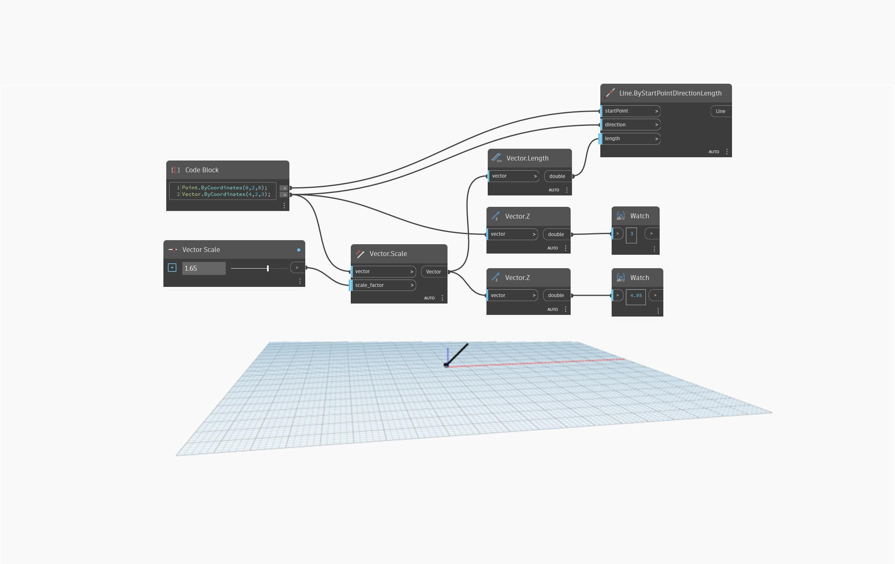

## Informacje szczegółowe
Węzeł `Vector.Z` zwraca wartość typu double reprezentującą wartość współrzędnej Z punktu odniesienia.

W poniższym przykładzie dwa węzły `Vector.Z` są używane do porównania wartości współrzędnych Z wektora pierwotnego i przeskalowanego.

___
## Plik przykładowy

