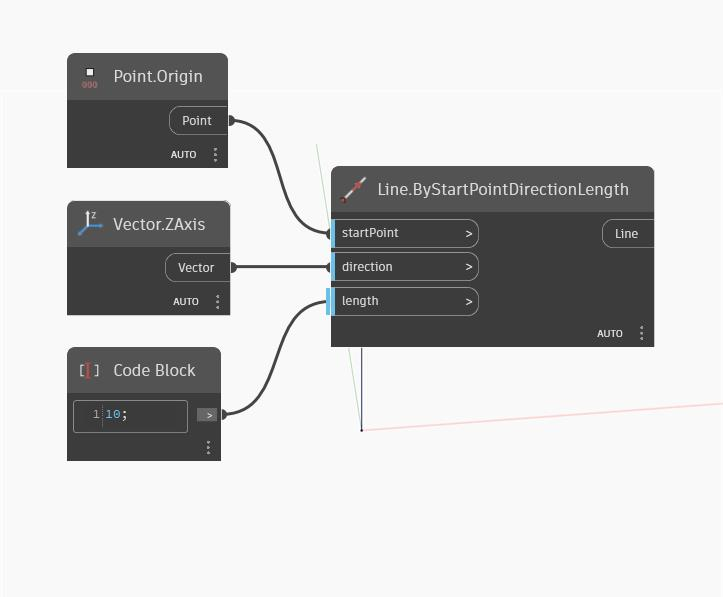

## Informacje szczegółowe
Węzeł ZAxis zwraca wektor (Vector) reprezentujący oś Z WorldCoordinateSystem (GUW). W poniższym przykładzie zwrócony Vector jest używany do utworzenia linii podążającej za osią Z GUW.
___
## Plik przykładowy

