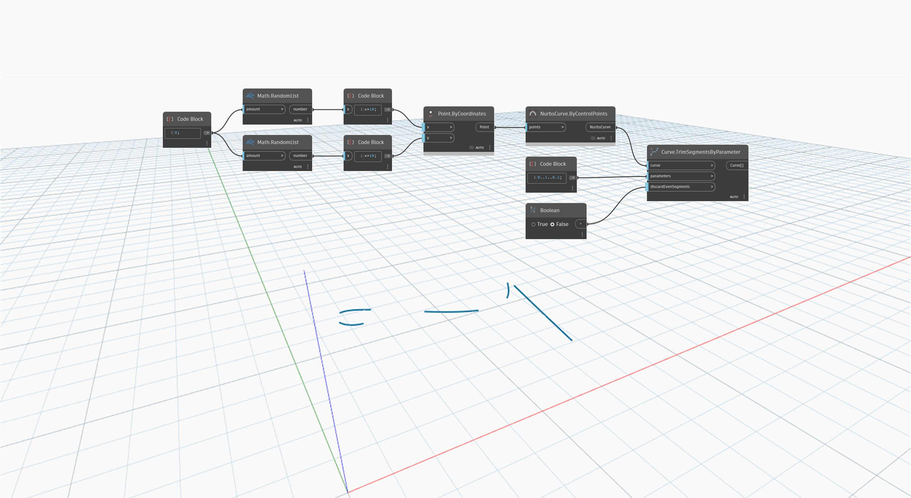

<!--- Autodesk.DesignScript.Geometry.Curve.TrimSegmentsByParameter(curve, parameters, discardEvenSegments) --->
<!--- BZCTQI2SIMCNMSCEHGSQLE6G74ND4ZQRICVGQCLVQ3OGHPBNX5NQ --->
## Informacje szczegółowe
Węzeł `Curve.TrimSegmentsByParameter (parameters, discardEvenSegments)` najpierw dzieli krzywą w punktach określonych za pomocą wejściowej listy parametrów (parameters). Następnie zwraca segmenty numerowane za pomocą liczb nieparzystych lub za pomocą liczb parzystych, zgodnie z wartością logiczną (Boolean) wprowadzoną za pomocą pozycji danych wejściowych `discardEvenSegments`.

W poniższym przykładzie najpierw tworzymy krzywą NurbsCurve za pomocą węzła `NurbsCurve.ByControlPoints` z danymi wejściowymi w postaci zestawu losowo wygenerowanych punktów. Za pomocą węzła `code block` tworzymy zakres liczb od 0 do 1 z krokiem 0,1. Tych liczb używamy jako parametrów wejściowych węzła `Curve.TrimSegmentsByParameter`, co skutkuje powstaniem listy krzywych tworzących wersję pierwotnej krzywej narysowaną za pomocą linii kreskowanej.
___
## Plik przykładowy

