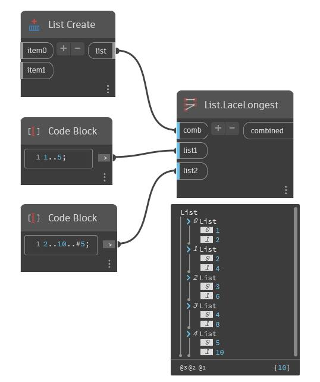

## Informacje szczegółowe
Stosuje kombinator do każdej pary powstałej z najkrótszego skratowania list danych wejściowych. Ostatni element wszystkich list jest powtarzany, tak aby odpowiadał długości najdłuższych danych wejściowych.
___
## Plik przykładowy

