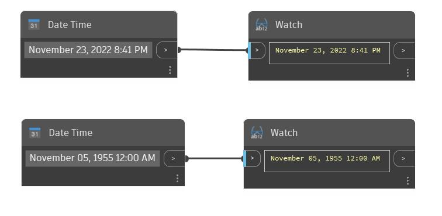

## Informacje szczegółowe
Węzeł DateTime tworzy obiekt typu datetime z określonymi w danych wejściowych miesiącem, dniem, rokiem i godziną. Format musi być następujący: „January 01, 1900 12:00 AM”, a nazwa miesiąca musi rozpoczynać się wielką literą i być zapisana w całości. Dzień musi być dwucyfrowy, a rok musi być czterocyfrowy.
___
## Plik przykładowy

