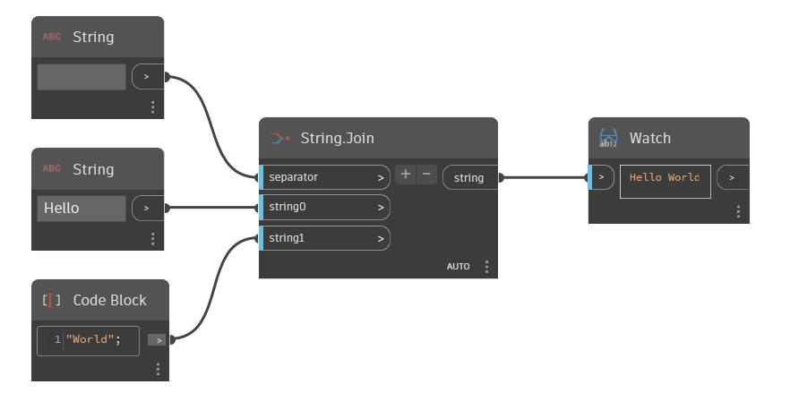

## Informacje szczegółowe
Węzeł String umożliwia użytkownikowi wprowadzenie wartości ciągu. Ciąg można również utworzyć za pomocą węzła Code Block, ujmując ciąg w cudzysłów. W poniższym przykładzie za pomocą węzła String i węzła Code Block tworzymy ciągi „Hello” i „World”. Za pomocą węzła String.Join te dwa ciągi zostają połączone. Drugi węzeł String używany z pustą spacją pełni rolę separatora, co daje w wyniku ciąg wyjściowy „Hello World”.
___
## Plik przykładowy

