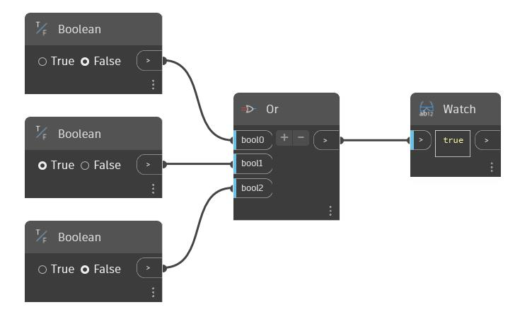

## Informacje szczegółowe
Węzeł Or pobiera zmienną liczbę wartości logicznych. Można zwiększyć lub zmniejszyć liczbę pozycji wejściowych, używając przycisków „+” i „-” w węźle Or. Każda pozycja wejściowa musi być pojedynczą wartością logiczną. Węzeł Or zwraca wartość prawda (true), jeśli przynajmniej jedna z pozycji wejściowych ma wartość prawda, a w przeciwnym razie, gdy wszystkie pozycje wejściowe mają wartość fałsz (false), zwraca wartość fałsz (false). W poniższym przykładzie trzy przełączniki logiczne są używane jako dane wejściowe węzła Or. Gdy wszystkie trzy są ustawione na wartość fałsz (false), węzeł Or zwraca wartość fałsz (false).
___
## Plik przykładowy

