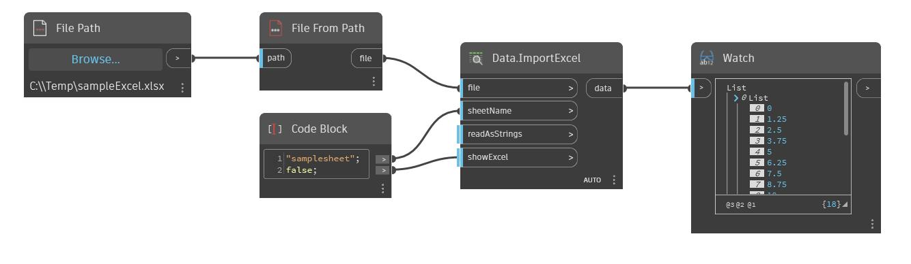

## Informacje szczegółowe
Węzeł Watch wyświetla dane wyjściowe węzła w formacie listy. W poniższym przykładzie zawartość pliku programu Excel jest zwracana jako lista i wyświetlana w węźle Watch. Ten węzeł jest przydatny przy analizowaniu struktur list, typów geometrii i innych elementów zwracanych przez różne węzły.
___
## Plik przykładowy

