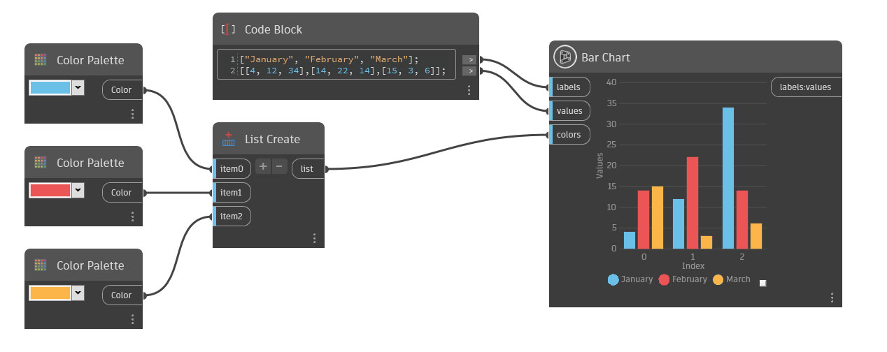

## Informacje szczegółowe

Węzeł Bar Chart tworzy wykres z pionowymi słupkami. Słupki można organizować w wiele grup i oznaczać kolorami. Możesz utworzyć pojedynczą grupę, wprowadzając pojedynczą wartość typu double, lub wiele grup, wprowadzając wiele wartości typu double na listę podrzędną w danych wejściowych wartości (values). Aby zdefiniować kategorie, wstaw listę wartości ciągów (string) w danych wejściowych etykiet (labels). Każda wartość tworzy nową kategorię oznaczoną kolorem.

Aby przypisać wartość (wysokość) do każdego słupka, należy wprowadzić listę list zawierających wartości typu double w danych wejściowych wartości (values). Każda lista podrzędna będzie określać liczbę słupków i kategorię, do której należą, w tej samej kolejności co dane wejściowe etykiet (labels). Jeśli istnieje pojedyncza lista wartości typu double, zostanie utworzona tylko jedna kategoria. Liczba wartości ciągów w danych wejściowych etykiet (labels) musi być zgodna z liczbą list podrzędnych w danych wejściowych wartości (values).

Kategorie można oznaczyć kolorami, wprowadzając listę kolorów w danych wejściowych kolorów (colors). W przypadku przypisywania kolorów niestandardowych liczba kolorów musi być zgodna z liczbą wartości ciągów w danych wejściowych etykiet (labels). W przypadku nieprzypisania kolorów zostaną użyte kolory losowe.

## Przykład: pojedyncza grupa

Wyobraź sobie, że chcesz przedstawić średnie oceny użytkownika dla elementu w ciągu pierwszych trzech miesięcy roku. Aby zwizualizować te dane, potrzebujesz listy trzech wartości w postaci ciągów oznaczonych etykietami Styczeń, Luty i Marzec.
W związku z tym w węźle Code Block w danych wejściowych etykiet (labels) zostanie przekazana następująca lista:

["Styczeń", "Luty", "Marzec"];

Listę można też utworzyć za pomocą węzłów String połączonych z węzłem List Create.

Następnie w danych wejściowych wartości (values) wprowadzimy średnią ocenę użytkownika dla każdego z trzech miesięcy w postaci listy list:

[[3.5], [5], [4]];

Ponieważ są trzy etykiety, potrzebujemy trzech list podrzędnych.

Teraz po uruchomieniu wykresu zostanie utworzony wykres słupkowy, na którym każdy kolorowy słupek będzie reprezentować średnią ocenę klienta dla danego miesiąca. Można korzystać z kolorów domyślnych lub dodać listę kolorów niestandardowych w danych wejściowych kolorów (colors).

## Przykład: wiele grup

Funkcję grupowania węzła Bar Chart można wykorzystać, wprowadzając więcej wartości na każdej liście podrzędnej w danych wejściowych wartości (values). W tym przykładzie utworzymy wykres wizualizujący liczbę drzwi w trzech wariantach trzech modeli: Model A, Model B i Model C.

Aby to zrobić, najpierw przekażemy etykiety:

[“Model A”, “Model B”, “Model C”];

Następnie przekażemy wartości, ponownie upewniając się, że liczba list podrzędnych odpowiada liczbie etykiet:

[[17, 9, 13],[12,11,15],[15,8,17]];

Teraz po kliknięciu przycisku Uruchom węzeł Bar Chart utworzy wykres zawierający trzy grupy słupków oznaczone odpowiednio indeksami 0, 1 i 2. W tym przykładzie każdy indeks (czyli grupę) należy uważać za wariant projektu. Wartości w pierwszej grupie (indeks 0) są pobierane z pierwszych elementów na poszczególnych listach w danych wejściowych wartości (values), więc pierwsza grupa zawiera wartość 17 dla modelu A, wartość 12 dla modelu B i wartość 15 dla modelu C. Druga grupa (indeks 1) używa drugich wartości w poszczególnych grupach itd.

___
## Plik przykładowy

