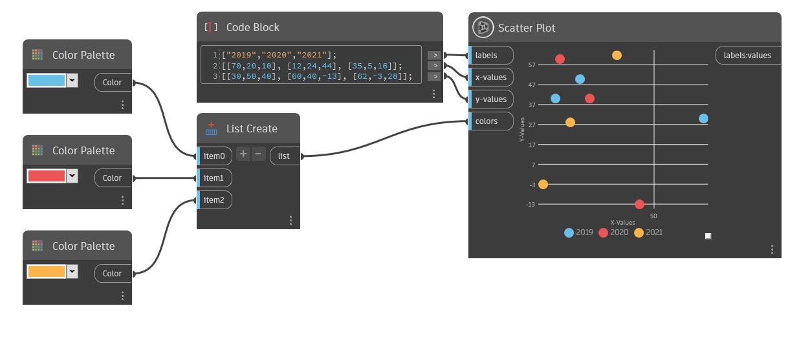

## Informacje szczegółowe

Węzeł Scatter Plot tworzy wykres z punktami kreślonymi według ich wartości x i y oraz oznaczonymi kolorami na podstawie grupy.
Dodaj etykiety do grup lub zmień liczbę grup, wstawiając listę wartości w postaci ciągów do danych wejściowych etykiet (labels). Każda etykieta tworzy odpowiednią grupę oznaczoną kolorem. Jeśli wprowadzona zostanie tylko jedna wartość ciągu, wszystkie punkty będą miały ten sam kolor i wspólną etykietę.

Aby określić położenia poszczególnych punktów, należy użyć listy list zawierającej wartości typu double dla wejść wartości x i y. Liczba wartości wejściowych x i y musi być równa. Ponadto liczba list podrzędnych musi zgadzać się z liczbą wartości w postaci ciągów w danych wejściowych etykiet (labels).

Grupy można oznaczyć kolorami, wprowadzając listę kolorów w danych wejściowych kolorów (colors). W przypadku przypisywania kolorów niestandardowych liczba kolorów musi być zgodna z liczbą wartości ciągów w danych wejściowych etykiet (labels). W przypadku nieprzypisania kolorów zostaną użyte kolory losowe.

___
## Plik przykładowy

